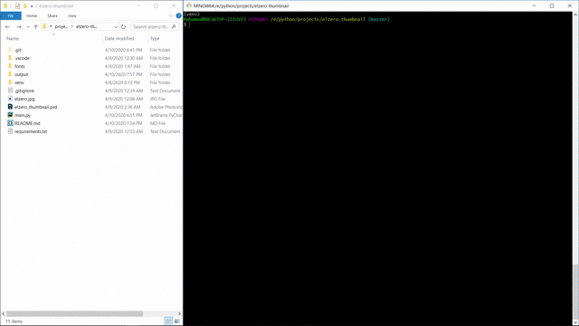

# Elzero thumbnail
------------------
**Generating Elzero thumbnail for his python course on YouTube.**


## Parameters
You can use `-h` or `--help` to list all parameters


**Required**
```bash
-s or --name // The name of the video
```

```bash
-n or --number // The number of the video
```

**Optional**

```bash
-f or --file // Thumbnail image to write on it
```

```bash
-o or --output // Output file name -without extension-
```

## Preview



